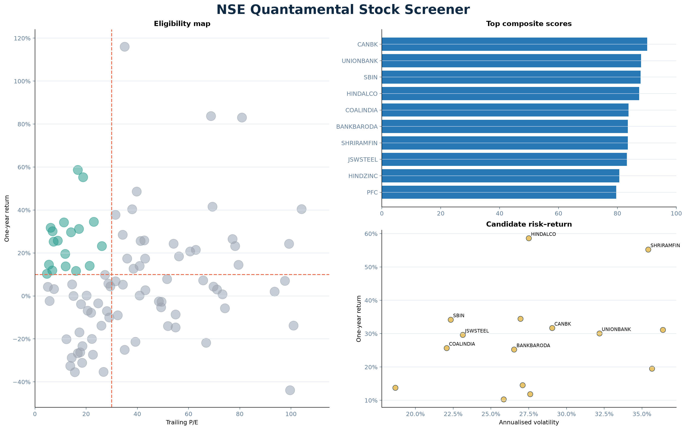

# NSE Quantamental Stock Screener

A reproducible Python screener combining **value**, **momentum**, and **size** across a
liquid NSE universe. It loads the official Nifty 100 constituent list, collects Yahoo
Finance prices and fundamentals, applies visible filters, and ranks qualifying stocks
with an auditable percentile model.



## The research question

> Which liquid NSE stocks combine a reasonable trailing P/E, positive one-year momentum,
> and sufficient market capitalisation—and which look strongest relative to the same
> universe?

The screener narrows a research list. It does not issue buy or sell recommendations.

## Default screening rules

- Positive trailing P/E no higher than **30x**
- Trailing one-year return of at least **10%**
- Market capitalisation of at least **₹10,000 crore**

All thresholds are command-line inputs. Missing values fail safely and appear in an
excluded-stocks audit file.

## What makes the project distinctive

After filtering, each complete stock receives:

- **Value Score:** percentile rank of positive trailing P/E; lower is better.
- **Momentum Score:** percentile rank of trailing one-year return; higher is better.
- **Composite Score:** `45% × Value + 55% × Momentum`.
- **Industry Rank:** rank among eligible peers in its NSE industry.
- **Momentum Efficiency:** one-year return divided by annualised volatility.

Market cap is deliberately an eligibility rule, not a score. Otherwise the model would
reward size once through the minimum threshold and again through ranking.

## Quick start on Windows

Open PowerShell inside this folder:

```powershell
python -m venv .venv
Set-ExecutionPolicy -Scope Process -ExecutionPolicy Bypass
.venv\Scripts\Activate.ps1
python -m pip install -r requirements.txt
python run_screener.py
```

The first live run can take several minutes because Yahoo serves company fundamentals
one ticker at a time. Results are cached locally for 24 hours.

Run the calculation checks:

```powershell
python -m pytest
```

## Change the investment rules

Example: P/E up to 25x, return of at least 15%, and market cap above ₹20,000 crore:

```powershell
python run_screener.py --max-pe 25 --min-return 15 --min-market-cap-crore 20000
```

Request the current official constituent file:

```powershell
python run_screener.py --refresh-universe
```

Reproduce the committed snapshot without internet:

```powershell
python run_screener.py --input-csv analysis_outputs/data/all_stocks.csv
```

## Outputs

| Output | Purpose |
|---|---|
| `ranked_candidates.csv` | Eligible stocks in composite-score order |
| `sector_champions.csv` | Best eligible stock in each NSE industry |
| `excluded_stocks.csv` | Rejection reason and missing-data audit |
| `all_stocks.csv` | Full collected dataset plus scores |
| `data_quality.csv` | Coverage summary |
| `analysis_summary.md` | Human-readable result and methodology |
| `NSE_Stock_Screener.xlsx` | Presentation-ready workbook and dashboard |

## Project structure

```text
nse-stock-screener/
├── .github/workflows/tests.yml
├── analysis_outputs/              # report, charts, CSV files, Excel workbook
├── config/nifty100_snapshot.csv   # official universe snapshot
├── docs/                           # walkthrough, interview, GitHub guides
├── stock_screener/                 # data, scoring, chart, report modules
├── tests/test_scoring.py
├── requirements.txt
└── run_screener.py
```

## Scope and sources

The universe comes from the official Nifty 100 constituent CSV published by Nifty
Indices. Prices, trailing P/E, and market cap come from Yahoo Finance through `yfinance`.

This is a **Nifty 100 screener**, not every NSE-listed security. Screening thousands of
listings through a free unofficial fundamentals endpoint would be unreliable; a liquid
index universe is a deliberate, honest scope. A custom universe CSV is supported.

## Limitations

- Trailing P/E can mislead for cyclicals, financials, and one-off earnings.
- Loss-making companies have no meaningful positive P/E and fail the filter.
- One-year return is backward-looking and date-sensitive.
- Percentile scores are relative to this universe, not absolute investment quality.
- The model omits leverage, cash flow, earnings growth, governance, and forecasts.
- Yahoo Finance can be delayed or missing and is not exchange-grade.

Read the [complete walkthrough](docs/PROJECT_WALKTHROUGH.md), [interview guide](docs/INTERVIEW_GUIDE.md),
and [GitHub guide](docs/GITHUB_GUIDE.md).

> Educational analysis only. This is not investment advice.

